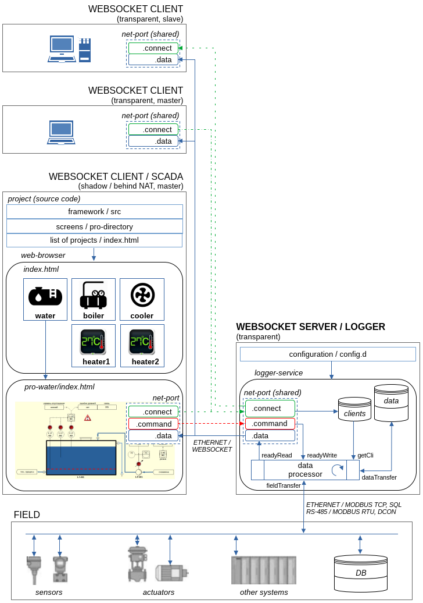

# WebSocket Server / Logger

- Configuration (examples)
- Documentation
- Source code (+ emulator)

### Hardware Platform

- PC, Server, Laptop
  - processor architectures
    - x86, x64, ARMv6, ARMv7, ...
  - interfaces
    - Ethernet/LAN or WiFi
    - RS-485
    - RS-232
    - USB

### Software Platform

- Framework / Language
  - Qt5 / C++11
- OS
  - Windows
  - Linux
- Network-protocols
  - ModBus RTU, TCP
  - DCON
  - WebSocket
- DB
  - MySQL5
  - MariaDB5
- Data format
  - JSON
- Multithreading
