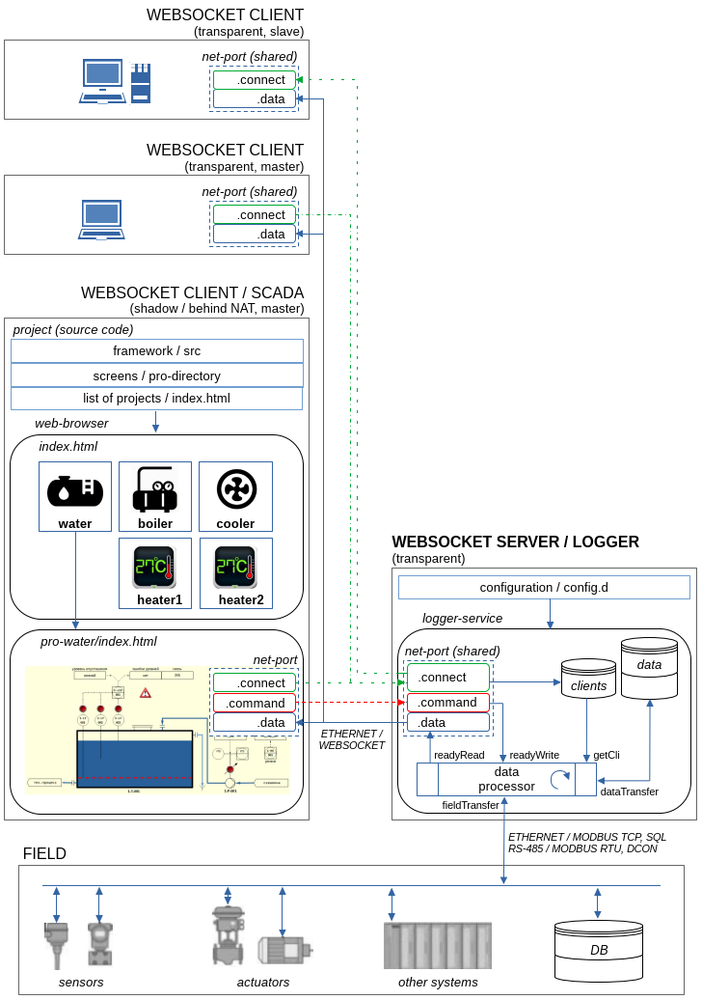

# WebSocket SCADA / Server (logger)

3.0.0

See [Releases](https://github.com/atgroup09/websocket-scada-server/releases) to download build version.

- Configuration (examples)
- Documentation
- Source code (+ emulator)

## BUILD WORKSPACE

### hardware platform

- Desktop / Oneboard PC
  - architectures
    - any

### software platform

- OS
  - Windows
  - Linux
- Framework / Language
  - Qt5 / C++11 (cross-compiler)
- IDE
  - Qt Creator (5.9.2)

## USER WORKSPACE

### hardware platform

- Desktop / Oneboard PC, Server
  - any architectures
- Network interfaces
  - Ethernet/LAN or WiFi
  - RS-485
  - RS-232
  - USB

### software platform

- OS
  - Windows
  - Linux
- Framework 
  - Qt5 (libraries)
- Interface
  - server-side
  - non-GUI (console version)
  - executable file or OS-service
  - multithreading
- Network protocols
  - ModBus RTU, TCP (all register tables)
  - DCON (command '6' only)
  - WebSocket (communication with HMI-clients)
- Data base
  - MySQL5
  - MariaDB5
- Data format (settings, websocket-data)
  - JSON
